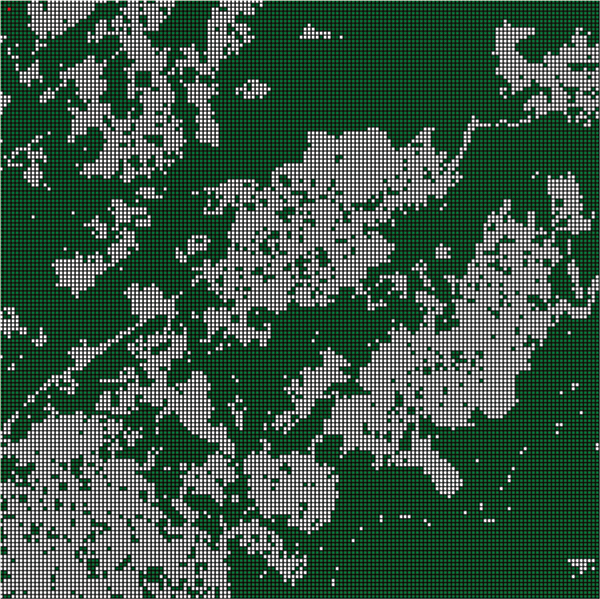

# Forest-Fire
This code was created with Python 3. It is based on the Tkinter graphics library. This code was created by Gauthier Guyaz in the context of a maturity work dealing with cellular automata and its applications.

# Summary
This simulation deals with the propagation of forest fires using a cellular automaton. The program uses the tkinter library to create a graphical interface that includes a canvas on which the automaton is drawn, as well as several buttons and sliders to control the simulation. The program also uses an appendix file called WindVector that contains functions to rasterize a list wind vector from the wind angle and speed. The program uses a main dictionary and a temporary dictionary to store the state of the cells in the automaton, and uses several functions to update these dictionaries, draw the automaton on the canvas, and manage the repetition of the automaton generations over time. Finally, the program contains functions to restart a new simulation, generate a random seed and add a LIDAR map to the simulation. This code is voluntarily entirely functional oriented for the advantages that this can offer in terms of simplicity speed, readability and robustness.

# Cellular Automaton
A cellular automaton is made of "cells", which can take several states. Each cell has a certain neighborhood which influences the transition rule to reach the next generation. 

The initial layout of the automaton is called "germ".

# LIDAR technology
The different tiles proposed for the simulations are real biotopes. 

It was possible to retrieve their LIDAR data from the [Swiss Confederation website](https://www.swisstopo.admin.ch/fr/geodata/height/surface3d.html) with the swissSURFACE3D program. 

They were then processed with the "CloudCompare" software to produce encoded images in PNG format. 

This allows us to import with some precision the position of each tree. 

# Formal definition

- Two dimensions

- Alphabets made up of the set: {empty; green; red; gray}. 
  (Respectively "other", "tree", "fire", "ash")
  
- Neighborhood composed on the direct bordering neighbors f to the cell and also
on the basis of the cells affected by the wind.

- **Transition rules**: 
  - Any "tree" cell belonging to the neighborhood V of a cell in fire
will take the state of fire at the next generation.
  - Any cell in fire will take at the next generation the state of ash.

# General design

Several devices allow the user to control the progress of the
of the forest fire simulation. They allow to launch, pause, reset and exit the simulation and quit the simulation, and to generate cell generations, create a seed.
The specific buttons are the following:

- The button " next gen " allows to generate a new generation.
- The button " start " allows to launch automatically a new generation at regular intervals.
- The button " stop " allows to pause the above process.
- The button " reset " allows to reinitialize the whole simulation.
- The button " quit " allows to quit the simulation.
- The button " input Lidar file " allows to load a Lidar file to create
a map of the forest.
- The button " input propo " allows to generate randomly a forest seed in relation to the two following cursors. 
- The slider " propo " allows to set the percentage of randomly generated tree cells.
- The " speed " and " angle " slider allows you to set the wind speed and angle for the simulation. The speed is the number of boxes touched by the wind at the next generation and the angle is clockwise and initialized at 12 o'clock.

It is also possible to left-click on a cell to transform it into a tree, click on it again to cancel. And right click to set a cell on fire.

# Screenshots 
## Example of a tile

  

